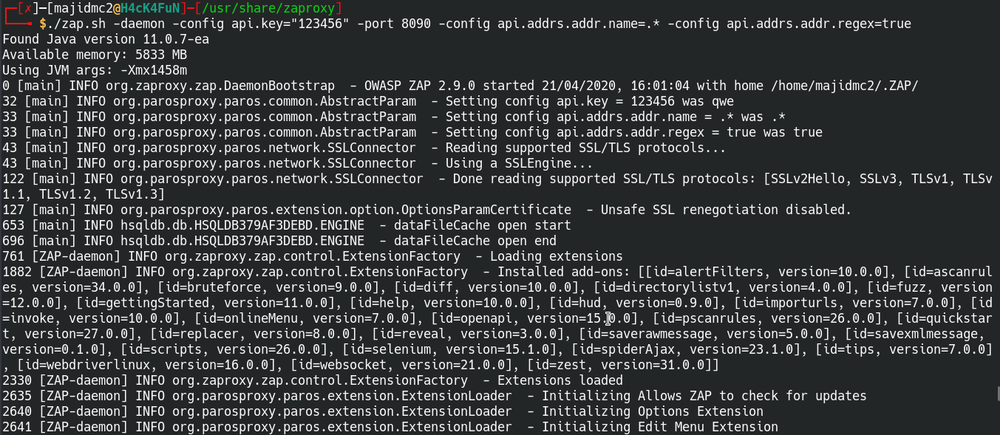
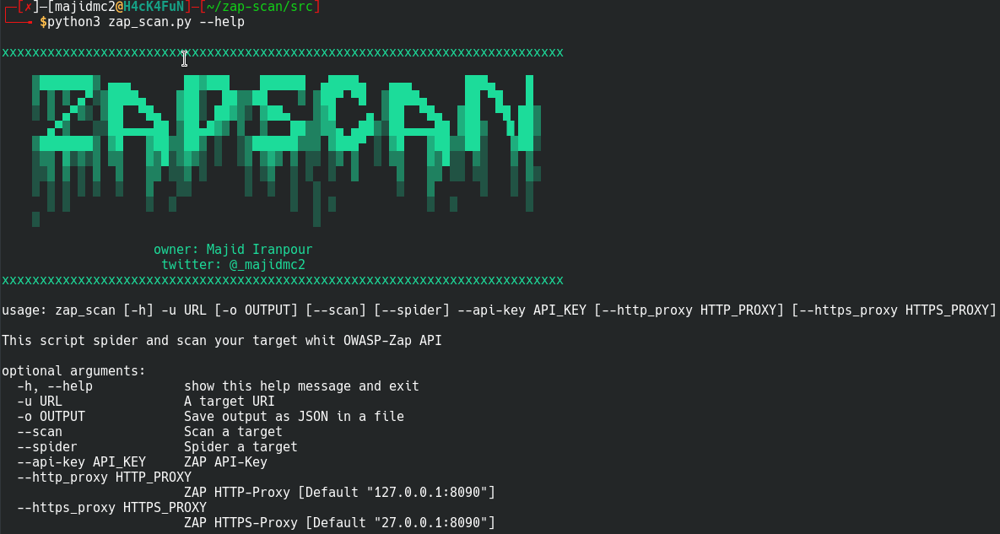
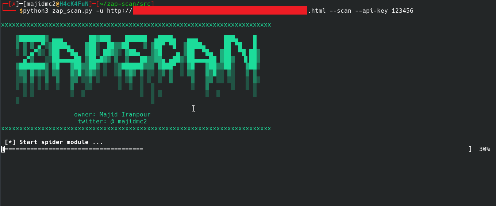

```                       
   

    ▒███████▒ ▄▄▄       ██▓███    ██████  ▄████▄   ▄▄▄       ███▄    █ 
    ▒ ▒ ▒ ▄▀░▒████▄    ▓██░  ██▒▒██    ▒ ▒██▀ ▀█  ▒████▄     ██ ▀█   █ 
    ░ ▒ ▄▀▒░ ▒██  ▀█▄  ▓██░ ██▓▒░ ▓██▄   ▒▓█    ▄ ▒██  ▀█▄  ▓██  ▀█ ██▒
      ▄▀▒   ░░██▄▄▄▄██ ▒██▄█▓▒ ▒  ▒   ██▒▒▓▓▄ ▄██▒░██▄▄▄▄██ ▓██▒  ▐▌██▒
    ▒███████▒ ▓█   ▓██▒▒██▒ ░  ░▒██████▒▒▒ ▓███▀ ░ ▓█   ▓██▒▒██░   ▓██░
    ░▒▒ ▓░▒░▒ ▒▒   ▓▒█░▒▓▒░ ░  ░▒ ▒▓▒ ▒ ░░ ░▒ ▒  ░ ▒▒   ▓▒█░░ ▒░   ▒ ▒ 
    ░░▒ ▒ ░ ▒  ▒   ▒▒ ░░▒ ░     ░ ░▒  ░ ░  ░  ▒     ▒   ▒▒ ░░ ░░   ░ ▒░
    ░ ░ ░ ░ ░  ░   ▒   ░░       ░  ░  ░  ░          ░   ▒      ░   ░ ░ 
      ░ ░          ░  ░               ░  ░ ░            ░  ░         ░ 
    ░                                    ░                               
                                                                 

```                       

## About
This script helps you on Web pentesting. It wrote with Python3 and used **OWASP-ZAP** APIs ([Link](http://`https://github.com/zaproxy/zap-api-python/` "Link")). It can **Spider** and **Scan** your target and shows the output in JSON format or save it in the file.

----

## Installation
#### Requirements
> OWASP-ZAP

> Python3.*

#### Run
At first you should clone the repository
> git clone https://github.com/majidmc2/zap-scan

Then install requirements packages with  **pip3.***
> cd zap-scan

> pip3 install -r requirements.txt

After That open the new terminal and run OWASP-ZAP daemen with your API-KEY and PORT(If you run OWASP-ZAP on your local, your address is: 127.0.0.1:8090)
> cd /usr/share/zaproxy/

> ./zap.sh -daemon -config api.key="<YOUR_API_KEY>" -port <YOUR-PORT | Default:8090> -config api.addrs.addr.name=.* -config api.addrs.addr.regex=true 
 

 
Finally run zap_scan.py
> cd src

> python3 zap_scan.py --help



#### Example




----
